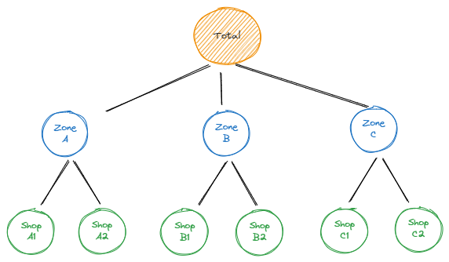

--- 
title: "Phân tích Chuỗi thời gian"
author: "Lê Huỳnh Đức"
date: "`r Sys.Date()`"
site: bookdown::bookdown_site
output: bookdown::gitbook
documentclass: book
description: "Time Serie Analysis"
---

# Lời nói đầu {-}

<!--chapter:end:index.Rmd-->

# Giới thiệu Cơ bản về Time Series
## Time Series là gì
Chuỗi thời gian là tập hợp các quan sát $y_t$ theo thời gian tuần tự.

Chuỗi thời gian rời rạc là tập hợp các điểm quan sát có khoảng cách quan sát lớn hơn một giây. Chuỗi thời gian rời rạc có thể có những đặc điểm:

- Thời gian thu thập các điểm dữ liệu có thể là không thường xuyên ( mỗi điểm mỗi phút) hoặc không quy tắc (hành vi đăng nhập của người dùng tại bất cứ thời điểm nào).

- Có thể bị mất dữ liệu do mất kết nối mạng hoặc máy chủ không phản hồi.

Chuỗi thời gian liên tục là tập hợp các điểm quan sát có khoảng cách quan sát là một giây.

```{block2, type='rmdnote'}
**Thời gian là gì**

Thời gian có thể định nghĩa theo:

- Giờ, phút giây
- Theo không gian: Máy thứ nhất, máy thứ hai trong cùng một băng chuyền
- Theo độ sâu: Xuống 1 milimet, xuống 2 milimet

Tóm lại, miễn các thông tin tuân theo thời gian và có hướng giá trị tuân theo 
```

---

## Các patterns Time Series

Khi mô tả về chuỗi thời gian, chúng ta thường nhắc đến các yếu tố như xu hướng, chu kỳ và theo mùa.

***Xu hướng***

Chúng ta nói dữ liệu có tính xu hướng khi nó tăng hoặc giảm trong một thời gian dài, xu hướng không nhất thiết phải là tăng/giảm tuyến tính, nó có thể là đường cong. Một chuỗi thời gian có thể tồn tại cả xu hướng tăng và xu hướng giảm cùng một lúc.

Ví dụ về dân số Việt Nam có xu hướng tăng hằng năm


Ví dụ về tỉ lệ tử vong của trẻ sơ sinh có xu hướng giảm dần thời gian nhờ có sự tiến bộ về y tế


Ví dụ về sự thay đổi của giá Bitcoin theo thời gian, giá bitcoin có xu hướng tăng mạnh từ giữa tháng 08/2020 đến 03/2021, đến tháng 11/2021 bắt đầu có xu hướng giảm dần


***Thời vụ***

Một chuỗi thời gian có tính chất thời vụ khi các giá trị của chuỗi thời gian bị ảnh hưởng bởi thời điểm nào đó trong năm hoặc theo ngày của mỗi tuần. Tính chất thời vụ luôn có tần suất tăng/giảm cố định và đã biết trước.
Ví dụ như

- Số lượng hành khách đặt vé máy bay tăng cao vào các ngày lễ tết.

- Lượng khách trong nhà hàng tăng cao vào các ngày cuối tuần.

- Lượng quần áo mua cao nhất vào tháng 12 cuối năm và thấp nhất vào tháng 1 mỗi năm


***Chu kì***

Biến đổi chu kỳ xảy ra khi một dữ liệu tăng giảm không có tần suất cố định. Những biến động này thường xảy ra do điều kiện kinh tế và hay gọi là "chu kì kinh doanh". Độ dài của một chu kì thường ít nhất là 2 năm.


***Irregularity***
Unexpected situations/events/scenarios and spikes in a short time span.

---

## Các đặc điểm của Time Series

### Stationary (Tính dừng của dữ liệu)

Chuỗi thời gian dừng là chuỗi có các đặc trưng thống kê như mean, variance, autocorrelation không đổi theo thời gian.

### Lag

Lag của Time Series thể hiện việc lùi về một mốc trước đó. Ví dụ lag(1) nghĩa là lùi về trước đó 1 đơn vị $X_{T-1}$. Lag(n) nghĩa là lùi về trước đó n đơn vị $X_{T-n}$

Ví dụ về số lượng quần áo bán ra của US từ năm 1992 đến năm 2019
```python
df = pd.read_csv('../data/us-retail-sales.csv')
df
```

```{.python_output}
	     Month	Clothing
0	1992-01-01	6938
1	1992-02-01	7524
2	1992-03-01	8475
3	1992-04-01	9401
4	1992-05-01	9558
...	...	...
331	2019-08-01	23829
332	2019-09-01	19567
333	2019-10-01	21400
334	2019-11-01	25170
335	2019-12-01	35157
```
Trong pandas, để tìm lag, ta dùng phương thức `shift`. Ví dụ

```python
df['lag_1'] = df['Clothing'].shift(1)
df['lag_3'] = df['Clothing'].shift(3)
df['lag_12'] = df['Clothing'].shift(12)
df
```

```{.python_output}
         Month  Clothing    lag_1    lag_3   lag_12
0   1992-01-01      6938      NaN      NaN      NaN
1   1992-02-01      7524   6938.0      NaN      NaN
2   1992-03-01      8475   7524.0      NaN      NaN
3   1992-04-01      9401   8475.0   6938.0      NaN
4   1992-05-01      9558   9401.0   7524.0      NaN
..         ...       ...      ...      ...      ...
331 2019-08-01     23829  21742.0  23079.0  23121.0
332 2019-09-01     19567  23829.0  21116.0  19782.0
333 2019-10-01     21400  19567.0  21742.0  21203.0
334 2019-11-01     25170  21400.0  23829.0  25364.0
335 2019-12-01     35157  25170.0  19567.0  33950.0
```

### Autocorrelation (Tự tương quan)

**Correlation**

Correlation là tương quan giữa 2 biến khác nhau, giá trị correlation nằm trong khoảng từ -1 đến 1, nếu giá trị càng tiến -1 nghĩa là 2 biến có sự tương quan nghịch, giá trị càng tiến đến +1 nghĩa là 2 biến có sự tương quan thuận

**Autocorrelation**

Autocorrelation là tương quan giữa một chuỗi timeseries và chuỗi đó với giá trị trước đó của chính nó. 
Ví dụ tương quan giữa `Clothing` và `lag_1`

```python
df[['Clothing','lag_1']].corr()
```

```{.python_output}
	        Clothing	   lag_1
Clothing	1.000000	0.518296
lag_1	    0.518296	1.000000
```

Tương quan giữa 2 biến này là 0.5


Để tính correlation giữa Timeseries và các lag của nó, ta sử dụng hàm `acf` trong statsmodel

```python
from statsmodels.api import tsa
tsa.acf(df['Clothing'])
```

```{.python_output}
array([1.        , 0.50679045, 0.42793583, 0.48943282, 0.54920848,
       0.51760066, 0.47709491, 0.50840091, 0.5311846 , 0.46104267,
       0.38738473, 0.45582436, 0.9264336 , 0.45220705, 0.37936738,
       0.43736208, 0.49102051, 0.46205604, 0.42158496, 0.4519868 ,
       0.47432784, 0.403097  , 0.33531148, 0.40104508, 0.85039363,
       0.39243258])
```
Ở đây correlation giữa `Clothing` và `lag_1` là 0.507, hơi khác so với dùng pandas, trong khuôn khổ phần này ta tập trung vào thư viện `statsmodels` hơn

Để visualize các giá trị correlation này ta dùng hàm `plot_acf`, ví dụ vẽ autocorrelation với lag tối đa là 30

```python
import matplotlib.pyplot as plt
from statsmodels.graphics.tsaplots import plot_acf
fig, ax = plt.subplots(figsize=(10, 5))
plot_acf(df['Clothing'], lags=30, ax=ax)
_ =plt.xticks(list(range(31)))
plt.show()
```


Trong hình vẽ ta có thể thấy, correlation tại lag=12 và lag=24 có giá trị rất cao, do đó có thể suy đoán được timeseries này có tính tuần hoàn sau 12 tháng 

#### Ứng dụng của Autocorrelation 
- **Xử lý Tín Hiệu và Thời Gian**:
    - **Phân tích chuỗi thời gian**: Được sử dụng để phát hiện chu kỳ, mô hình chuỗi thời gian, và dự đoán giá trị trong tương lai.
    - **Xử lý âm thanh**: Trong xử lý tín hiệu âm thanh, tự động tương quan có thể được sử dụng để phát hiện các tần số quan trọng và các sự kiện lặp lại trong dữ liệu âm thanh.
- **Khoa học Dữ Liệu**:
    - **Phân tích dữ liệu**: Trong khoa học dữ liệu và thống kê, tự động tương quan giúp phát hiện mối tương quan giữa các biến và mô tả sự phụ thuộc thời gian của dữ liệu.
    - **Phát hiện xu hướng và chu kỳ**: Tự động tương quan có thể giúp xác định xu hướng và chu kỳ trong dữ liệu, giúp các nhà nghiên cứu và chuyên gia dự đoán và phân tích xu hướng thị trường, tình hình thời tiết, và nhiều ứng dụng khác.
- **Kỹ thuật và Kỹ thuật số**:
    - **Xử lý ảnh**: Trong xử lý ảnh, tự động tương quan có thể được sử dụng để phát hiện biến đổi không gian và mô hình hình dạng.
    - **Kỹ thuật số và mạng truyền thông**: Trong mạng truyền thông số và kỹ thuật số, tự động tương quan giúp phân tích tín hiệu, phát hiện tín hiệu trong nhiễu và cải thiện chất lượng truyền thông.
- **Tài chính và Kinh tế**:
    - Phân tích thị trường: Trong tài chính, tự động tương quan giúp phân tích và dự đoán xu hướng thị trường, giúp các nhà giao dịch và nhà đầu tư hiểu rõ hơn về sự biến động và rủi ro trong thị trường tài chính.
- **Khoa học và Tâm lý học**:
    - **Nghiên cứu tâm lý**: Trong nghiên cứu tâm lý, tự động tương quan có thể được sử dụng để phân tích sự phụ thuộc thời gian của các biến tâm lý và hành vi, giúp hiểu rõ hơn về sự ảnh hưởng và tương tác giữa các yếu tố khác nhau trong tâm lý học.
Như vậy, tự động tương quan là một công cụ quan trọng và linh hoạt, được sử dụng rộng rãi trong nhiều lĩnh vực để phân tích, mô hình, và hiểu rõ hơn về sự phụ thuộc và tương tác trong dữ liệu và các hệ thống phức tạp.

### Partial Autocorrelation

Partial Autocorrelation cũng tương tự như Autocorrelation. Tuy nhiên, nó mở rộng hơn bằng cách loại bỏ ảnh hưởng của các mốc thời gian trước đó.

Ví dụ tương quan Partial Autocorrelation với lag = 3 sẽ bỏ qua các giá trị trễ tại lag = 1 và lag = 2


## Các bài toán về chuỗi thời gian

### Dự báo chuỗi thời gian

### Phân loại chuỗi thời gian

### Phân đoạn chuỗi thời gian


## Pandas Time Series
## TimeSeries Decomposition

<!--chapter:end:posts/01-Introduction.Rmd-->

# Stationarity và Time Series Smoothing

## Stationarity
## Smoothing

Kỹ thuật làm mịn là một trong các kỹ thuật tiền xử lý dữ liệu để loại bỏ các nhiễu trong dữ liệu. Việc làm mịn dữ liệu giúp xóa bỏ mùa vụ của dữ liệu và giúp đơn giản hóa các mô hình dự đoán.

Các kỹ thuật làm mịn dữ liệu bao gồm:

- Làm mịn trung bình trượt (Moving Average Smoothing)
- Làm mịn cấp số nhân (Exponential Smoothing)

### Moving Average Smoothing

Có 2 loại trung bình trượt : Centered MA và Trailing MA

#### Centered Moving Average

Với trung bình trượt với cửa sổ trượt $k$ bằng 3 ta có:

$$\begin{aligned}
\Large s_{t} = \frac{y_{t+1} + y_{t} + y_{t-1}}{3}
\end{aligned}$$


Tổng quát hơn

$$\begin{aligned}
\Large s_{t} = \frac{1}{k}  \sum_{j=-m}^{m}{y_{t+j}}
\end{aligned}$$

Trong đó $k = 2m + 1$

Phương pháp này sử dụng giá trị tương lai $y_{t+1}$ do đó không áp dụng được vào các mô hình dự báo. Phương pháp dùng để thống kê mô tả dữ liệu

#### Trailing Moving Average

Với trung bình trượt với cửa sổ trượt $k$ bằng 3 ta có

$$\begin{aligned}
\Large s_{t} = \frac{y_{t} + y_{t - 1} + y_{t - 2}}{3}
\end{aligned}$$

Tổng quát hơn

$$\begin{aligned}
\Large s_{t} = \frac{1}{k} \sum^{k}_{i=1}{y_{t-i+1}}
\end{aligned}$$

Phương pháp này chỉ sử dụng dữ liệu quá khứ nên có thể áp dụng cho việc dự báo các giá trị tương lai

#### Ví dụ

Dưới đây là ví dụ về số bé gái sinh ra mỗi ngày


```python
df = pd.read_csv('../data/daily-total-female-births.csv')
df['Date'] = pd.to_datetime(df['Date'])
df['lag_1'] = df['Births'].shift(1)
df['lag_2'] = df['Births'].shift(2)
df['lead_1'] = df['Births'].shift(-1)
df['Centered_MA'] = (df['Births'] + df['lead_1'] + df['lag_1'])/3
df['Trailing_MA'] = (df['Births'] + df['lag_1'] + df['lag_2'])/3
```

```{.python_output}
          Date Births	lag_1	lag_2	lead_1	Centered_MA	Trailing_MA
0	1959-01-01	   35	  NaN	  NaN	  32.0	        NaN	        NaN
1	1959-01-02	   32	 35.0	  NaN	  30.0	  32.333333	        NaN	
2	1959-01-03	   30	 32.0	 35.0	  31.0	  31.000000	  32.333333
3	1959-01-04	   31	 30.0	 32.0	  44.0	  35.000000	  31.000000
4	1959-01-05	   44	 31.0	 30.0	  29.0	  34.666667	  35.000000
...		   ...	  ...	  ...	  ...	   ...	        ...	        ...
360	1959-12-27	   37	 34.0	 44.0	  52.0	  41.000000	  38.333333
361	1959-12-28	   52	 37.0	 34.0	  48.0	  45.666667	  41.000000
362	1959-12-29	   48	 52.0    37.0	  55.0	  51.666667	  45.666667
363	1959-12-30	   55	 48.0    52.0	  50.0	  51.000000	  51.666667
364	1959-12-31	   50	 55.0    48.0	   NaN	        NaN	  51.000000
```

Ta cũng có thể sử dụng phương thức `rolling()` trong Pandas

```python
df['Centered_MA'] = df['Births'].rolling(window=3, center=True).mean()
df['Trailing_MA'] = df['Births'].rolling(window=3, center=False).mean()
```

Để visualize dữ liệu, ta có thể dùng `seaborn`


```python
import seaborn as sns
import matplotlib.pyplot as plt 

plt.figure(figsize=(10,5))
plt.title("Births", fontsize=15)
sns.lineplot(x='Date', y='Births', data=df, label='original')
# sns.lineplot(x='Month', y='Centered_MA', data=df, label='Centered_MA')
sns.lineplot(x='Date', y='Births', data=df, label='Trailing_MA')
plt.xlabel('Date',fontsize=15)
plt.yticks(fontsize=15)
plt.ylabel('Births',fontsize=15)
plt.legend(fontsize=15)
```


với các tham số $k =6$ và $k=12$
```python
fig1 = plt.figure(figsize=(10,5))
df['Births_MA'] = df['Births'].rolling(window=6, center=False).mean()
sns.lineplot(x='Date', y='Births', data=df, label='original')
sns.lineplot(x='Date', y='Births_MA', data=df, label='6-MA')
plt.xlabel('Month',fontsize=15)
plt.xticks(fontsize=15)
plt.yticks(fontsize=15)
plt.ylabel('Birds',fontsize=15)
plt.legend(fontsize=15)
plt.title('6-MA', fontsize=15)
```


```python
fig2 = plt.figure(figsize=(10,5))
df['Births_MA'] = df['Births'].rolling(window=12, center=False).mean()
sns.lineplot(x='Date', y='Births', data=df, label='original')
sns.lineplot(x='Date', y='Births_MA', data=df, label='12-MA')
plt.xlabel('Date',fontsize=15)
plt.xticks(fontsize=15)
plt.yticks(fontsize=15)
plt.ylabel('Date',fontsize=15)
plt.legend(fontsize=15)
plt.title('12-MA', fontsize=15)
```


### Exponential Smoothing

Hàm làm mịn Exponential là một hàm làm mịn sử dụng hàm mũ. Trong khi các hàm Moving Average đơn giản sử dụng các giá trị quá khứ với trọng số bằng nhau thì hàm Exponential sử dụng hàm số mũ cho trọng số đảm bảo giảm dần theo thời gian.

#### Simple Exponential Smoothing
Hàm làm mịn Exponential thường áp dụng vào xử lý tín hiệu số để lọc những nhiễu có tầm số cao. Hàm này là dạy truy hồi với công thức như sau

$s_{0} = y_{0}$

$s_{t} = \alpha y_{t} + (1 - \alpha)s_{t-1},  t > 0$

Trong đó $\alpha$ được gọi là tham số smoothing và  $0 < \alpha < 1$

**Tại sao lại gọi là Hàm mũ**

Với công thức Truy hồi trên ta có thể biến đổi như sau

$s_t = \alpha y_t + (1 - \alpha)s_{t-1}$

$s_t = \alpha y_t + (1 - \alpha)(\alpha y_{t-1} + (1 - \alpha)s_{t-2})$

$s_t = \alpha y_t + \alpha(1 - \alpha)y_{t-1} + (1-\alpha)^2s_{t-2}$

$s_t = \alpha[y_t + (1 - \alpha)y_{t-1} + (1-\alpha)^2y_{t-2} + (1-\alpha)^3y_{t-3} + ... +(1-\alpha)^Ty_0]$


Ta có thể thấy $s_t$ có liên quan đến trung bình các giá trị với các trọng số 
$1, (1-\alpha), (1-\alpha)^2, ....,(1-\alpha)^T$

Dưới đây là code mẫu cho cách tính Exponential Smoothing

```python
def exponential_smoothing(Y, alpha):
	S = np.zeros(Y.shape[0])
	S[0] = Y[0]
	for t in range(1, Y.shape[0]):
		S[t] = alpha * Y[t] + (1- alpha) * S[t-1]
	return S
```
Hoặc chúng ta cũng có thể sử dụng phương thức `ewm` của `Pandas` hoặc Class `SimpleExpSmoothing` của thư viện `statsmodel.tsa`

```python
from statsmodels.api import tsa
## dùng pandas
df['ExponentialSmoothing_PANDAS'] = df['Births'].ewm(alpha=0.3, adjust=False).mean()
## dùng functions
df['ExponentialSmoothing_FUNCTION'] = exponential_smoothing(df['Births'], 0.3)
## dùng tsa
es = tsa.SimpleExpSmoothing(df['Births'])
df['ExponentialSmoothing_tSA'] = es.predict(es.params, start=1, end=df.shape[0])
df
```

```{.python_output}
	Date	    Births	ExponentialSmoothing_PANDAS	ExponentialSmoothing_FUNCTION	ExponentialSmoothing_tSA
0	1959-01-01		35					  35.000000						35.000000				   35.000000
1	1959-01-02		32					  34.100000						34.100000				   34.100000
2	1959-01-03		30					  32.870000						32.870000				   32.870000
3	1959-01-04		31					  32.309000						32.309000				   32.309000
4	1959-01-05		44					  35.816300						35.816300				   35.816300
...		   ...	   ...							...							  ...						 ...
360	1959-12-27	    37					  38.828280						38.828280				   38.828280
361	1959-12-28		52					  42.779796						42.779796				   42.779796
362	1959-12-29		48					  44.345857						44.345857				   44.345857
363	1959-12-30		55					  47.542100						47.542100				   47.542100
364	1959-12-31		50					  48.279470						48.279470				   48.279470
```

Biểu đồ so sánh giữa giá trị gốc và Exponential Smoothing
```python
fig4= plt.figure(figsize=(10,5))
sns.lineplot(x='Date', y='Births', data=df, label='original')
sns.lineplot(x='Date', y='ExponentialSmoothing_PANDAS', data=df, label='ExponentialSmoothing')
plt.xlabel('Date',fontsize=15)
plt.xticks(fontsize=15)
plt.yticks(fontsize=15)
plt.ylabel('Births',fontsize=15)
plt.legend(fontsize=15)
plt.title('Exponential Smoothing with alpha=0.3', fontsize=15)
```


#### Double Exponential Smoothing (Holt's Method) 

#### Triple Exponential Smoothing (Holt-Winters' Method)

<!--chapter:end:posts/02-Smoothing.Rmd-->

# ARIMA
## Autoregressive Model
Mô hình tự hồi quy là mô hình ước lượng giá trị tương lai của timeseries dựa vào các giá trị trong quá khứ cửa chính timeseries đó.

Công thức tự hồi quy được biểu diễn như sau

$$
y_t = c + \phi_1 y_{t-1} + \phi_2 y_{t-2} + \phi_3 y_{t-3} + .... + \phi_p y_{t-p} + \epsilon_t
$$

Hoặc có thể viết lại

$$
y_t = c + \sum^{p}_{1}\phi_{i} y_{t-i} + \epsilon_t
$$

Trong đó: $\epsilon_t$ là nhiễu trắng. Có thể nói mô hình này là mô hình hồi quy đa biến với các biến là các giá trị lag tại thời điểm từ $1$ đến $p$. Chúng ta kí hiệu mô hình này là $AR(p)$

Và khi đó giá trị dự đoán sẽ là:

$$
\hat{y}_{t+1} = c + \sum^{p}_{1}\phi_{i} y_{t-i+1}
$$
Để sử dụng AR model, ta dùng class `AutoReg` của thư viện `statsmodels`, chúng ta dùng `root_mean_squared_error` để đánh giá mô hình. Mô hình sẽ được huấn luyện và dự đoán cho 7 ngày tiếp theo

```python
from statsmodels.tsa.ar_model import AutoReg
import pandas as pd 
import numpy as np

# Đọc dữ liệu
df = pd.read_csv('../data/daily-total-female-births.csv')
df.head()

# Chia dữ liệu thành train test
Y = df.Births.values
train, test = Y[:len(Y)-7], Y[len(Y)-7:]

# Huấn luyện mô hình với p=2
AR_model = AutoReg(train, lags=2)
AR_results = AR_model.fit()
# Dự đoán kết quả mô hình
Y_hat = AR_results.forecast(7)
for y_hat, y_true in zip(Y_hat, test):
    print(f'Predicted={y_hat} \tExpected={y_true}')
```

```python
Predicted=41.009982996211406 	Expected=44
Predicted=41.3395707860348 	    Expected=34
Predicted=41.741049087971845 	Expected=37
Predicted=41.8524930508191 	    Expected=52
Predicted=41.91850636281712 	Expected=48
Predicted=41.94330911921793 	Expected=55
Predicted=41.95535989900887 	Expected=50
```

Để xem các params của mô hình ta gọi `model_fit.params`. Trong đó giá trị đầu tiên là hằng số $c$, các giá trị tiếp theo tương ứng là các $\phi$ tại các lag 

```python
AR_results.params
```

```
array([29.46548462,  0.18468755,  0.11315929])
```

Để đánh giá kết quả mô hình, chúng ta dùng thư viện `sklearn.metrics`

```python
from sklearn.metrics import mean_squared_error
print('RMSE:', np.sqrt(mean_squared_error(test, Y_hat)))
```

```
8.110283777968577
```

Dưới đây là biểu đồ thể hiện giá trị Dự đoán và giá trị thực tế trong 7 ngày


Chúng ta có thể mô phỏng lại cách tính các giá trị dự đoán dựa trên các params của model với $c=29.46548462, \phi_t=0.18468755, \phi_{t-1}=0.11315929$

```python
Y_hat_sim = list(train[-2:])
c = 29.46548462
phi_1 = 0.18468755
phi_2 = 0.11315929

for i in range(7):
    predict = c + phi_1*Y_hat_sim[-1] + phi_2*Y_hat_sim[-2]
    Y_hat_sim.append(predict)

for a, b in zip(Y_hat_sim[2:], Y_hat):
    print(f"Simulated={a} \t Predicted={b}")
```

```
Simulated=41.00998312 	         Predicted=41.009982996211406
Simulated=41.33957094797416 	 Predicted=41.3395707860348
Simulated=41.74104926920371 	 Predicted=41.741049087971845
Simulated=41.85249324133591 	 Predicted=41.8524930508191
Simulated=41.918506557292 	     Predicted=41.91850636281712
Simulated=41.94330931564456 	 Predicted=41.94330911921793
Simulated=41.95536009628208 	 Predicted=41.95535989900887
```

### Mô phỏng cách tính AutoRegressive Model bằng Sklearn

```python
df['Births_shift_1'] = df['Births'].shift(1)
df['Births_shift_2'] = df['Births'].shift(2)

train = df.iloc[:len(df)-7]
train.dropna(inplace=True)

from sklearn.linear_model import LinearRegression
model = LinearRegression()
model.fit(train[['Births_shift_1','Births_shift_2']], train['Births'])

print(model.intercept_ , model.coef_)
```

```{.python_output}
29.46548461980426 [0.18468755 0.11315929]
```

Ta có thể thấy các parameters sau khi dùng `sklearn` tương tự với các params của thư viện `statsmodels`
## Moving Average Model

Thay vì sử dụng các giá trị trong quá khứ làm đầu vào để dự đoán, Moving Average Model sử dụng các lỗi dự báo của quá khứ để dự đoán giá trị tiếp theo. 

Lưu ý cần phân biệt Moving Average Smoothing và Moving Average Model.

**Moving Average Smoothing**

> Ý tưởng chính là sử dụng một cửa sổ trượt trên chuỗi dữ liệu và tính trung bình của các giá trị trong cửa sổ đó. Kết quả là chuỗi dữ liệu mới, nơi mà các dao động ngắn hạn hoặc nhiễu được giảm thiểu, giúp nhận diện xu hướng và mô hình hóa chuỗi dữ liệu dễ dàng hơn.

> Ví dụ, khi bạn thấy một chuỗi dữ liệu có nhiều dao động ngắn hạn và bạn muốn làm trơn nó để nhận diện xu hướng chung, bạn có thể sử dụng moving average smoothing để tạo ra một phiên bản làm trơn của chuỗi dữ liệu.

Công thức MA model như sau

$$
y_t = c + \theta_1 \epsilon_{t-1} + \theta_2 \epsilon_{t-2} + \theta_3 \epsilon_{t-3} + .... + \theta_q \epsilon_{t-q} + \epsilon_t 
$$
Hoặc có thể viết lại

$$
y_t = c  + \sum^{q}_{i=1}\theta_{i}\epsilon_{t-i} +  \epsilon_t
$$

Trong đó $c$ là trung bình series, $\epsilon_{t-i}$ là white noise tại $t-i$. Trong thực tế, chúng ta không có quan sát cho các giá trị white noise này, do đó nó không thực sự là hồi quy theo nghĩa hiểu thông thường.

Và khi đó giá trị dự đoán sẽ là 

$$
\hat{y}_{t+1} = c  + \sum^{q}_{i=1}\theta_{i}\epsilon_{t-i+1}
$$

Trong thư viện `statsmodels` không hỗ trợ chính thức cách tính **Moving Average Model**, nhưng chúng ta có thể áp dụng thông qua `ARIMA`. 

Ví dụ về cách sử dụng ARMA

```python
# Huấn luyện mô hình với q=2
MA_model = ARIMA(train, order=(0, 0, 2))
MA_results = MA_model.fit()
# Dự đoán kết quả mô hình
Y_hat = MA_results.predict(start=len(train), end=len(train)+len(test)-1, dynamic=False)
for y_hat, y_true in zip(Y_hat, test):
    print(f'Predicted={y_hat} \tExpected={y_true}')
```

```
Predicted=41.11548396873163 	Expected=44
Predicted=41.5656013608698  	Expected=34
Predicted=41.89874024020355 	Expected=37
Predicted=41.89874024020355 	Expected=52
Predicted=41.89874024020355 	Expected=48
Predicted=41.89874024020355 	Expected=55
Predicted=41.89874024020355 	Expected=50
```

xem các tham số $\theta$

```python
MA_results.maparams
```

```
array([0.17900771,  0.11330768])
```

xem tham số $c$

```python
MA_results.params[0]
```

```
41.89874024020355
```
Đánh giá kết quả mô hình

```{.python_output}
print('RMSE:', np.sqrt(mean_squared_error(test, Y_hat)))
```

```
RMSE: 8.15992514853609
```

để xem các espilon

```python
MA_results.resid
```

```
array([-6.89874024e+00, -8.58294190e+00, -9.63603195e+00, -8.20730676e+00,
...
       -4.87763328e+00, -2.26772814e+00, -2.94012608e+00])
```
Dưới đây là biểu đồ thể hiện giá trị Dự đoán và giá trị thực tế trong 7 ngày


Nếu để ý kỹ, chúng ta sẽ thấy kể từ giá trị dự đoán thứ 3, giá trị dự đoán bằng đầu là một giá trị không đổi 41.89874024020355. Lý do là mô hình không biết trước các sai số dự đoán của các giá trị tiếp theo để từ bước tính toán thứ 3.
Để mô phỏng lại cách tính toán.
Ta có $c = 41.89874024 ,\theta_{t} = 0.17900771, \theta_{t-1} = 0.11330768$
và
$resid_t = -2.94012608, resid_{t-1}=-2.26772814$
```python
c = 41.89874024
theta_t = 0.17900771
theta_t_prev_1 = 0.11330768
resid_t = -2.94012608
resid_t_prev_1 = -2.2677281
```

lúc này, giá trị dự báo cho T+1 sẽ là:
```python
c + theta_t * resid_t + theta_t_prev_1 * resid_t_prev_1
```

```
41.11548399342612
```
lúc này, giá trị dự báo cho T+2 sẽ là:

```python
resid_t_prev_1 = resid_t
resid_t = 0
c + theta_t * resid_t + theta_t_prev_1 * resid_t_prev_1
```

```
41.565601374967706
```

Và giá trị từ T+3 trở đi sẽ là

```python
resid_t_prev_1 = resid_t # = 0
# lúc này resid_t từ T+2 đã bằng 0 
# nên giá trị resid_t_previous_1 cũng bằng 0, 
# do đó kết quả trở về giá trị trung bình c
resid_t = 0
c + theta_t * resid_t + theta_t_prev_1 * resid_t_prev_1
```

```
41.89874024
```

Đây cũng chính là điểm yếu của mô hình Moving Average


## AutoRegressive Moving Average Model

Như cái tên của nó, mô hình này kết hợp 2 Mô hình Autoregressive và Moving Average

Nhăc lại công thức AR

$$
y_t = c + \sum^{p}_{1}\phi y_{t-i} + \epsilon_t
$$

Và công thức MA

$$
y_t = c  + \sum^{q}_{i=1}\theta_{i}\epsilon_{t-i} +  \epsilon_t
$$

Do đó công thức ARMA là kết hợp cả hai công thức.

$$
y_t = c + \epsilon_t + \sum^{p}_{1}\phi y_{t-i}  + \sum^{q}_{i=1}\theta_{i}\epsilon_{t-i}
$$

Tương tự, trong thư viện `statsmodels` không hỗ trợ chính thức cách tính **Moving Average Model**, nhưng chúng ta có thể áp dụng thông qua `ARIMA`. Ở phần sau chúng ta sẽ tìm hiểu về `ARIMA` rồi quay ngược lại ví dụ về `MA`

### Autogregressive Integrated Moving Average Model

<!--chapter:end:posts/03-ARIMA_Model.Rmd-->

# Dữ liệu Chuỗi thời gian đa biến

<!--chapter:end:posts/04-Mutivariate.Rmd-->

# Các mô hình phương sai có điều kiện thay đổi

<!--chapter:end:posts/05-ARCH.Rmd-->

# Dự đoán Time Series dạng thứ bậc

Tham chiếu đến [Figure 1](#figure-1)

abc \@ref(fig:hiertree)
<figure align="center" id="figure-1">
  
  <figcaption>Figure 1 - Minh họa cây thứ bậc</figcaption>
</figure>

```{r hiertree, fig.cap="Minh họa cây thứ bậc" out.width="100%"}

```

<!--chapter:end:posts/06-Hierachical_Forecasting.Rmd-->

# Các mô hình cây trong Time Series

<!--chapter:end:posts/07-Tree_based.Rmd-->

# Deep Learning trong Time Series

<!--chapter:end:posts/08-Deeplearning.Rmd-->

# Mô hình phân tích sống sót

<!--chapter:end:posts/09-Survival_Analysis.Rmd-->

# Packages

## TSLearn

https://tslearn.readthedocs.io/en/stable/index.html

## MLForecasting

https://github.com/Nixtla/mlforecast


## Prophet

<!--chapter:end:posts/99-packages.Rmd-->

