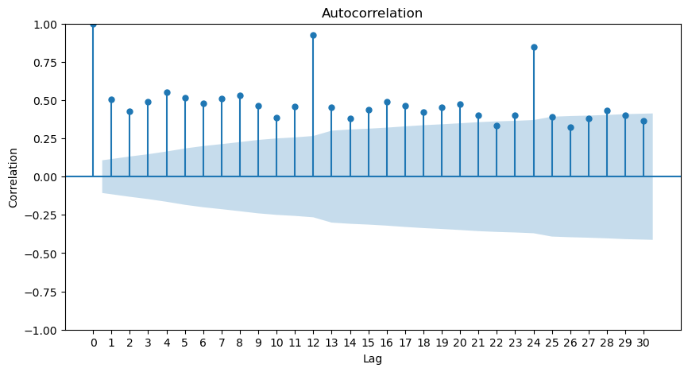

# Một số đặc tính của Time Series

## Lag

Lag của Time Series thể hiện việc lùi về một mốc trước đó. Ví dụ lag(1) nghĩa là lùi về trước đó 1 đơn vị $X_{T-1}$. Lag(n) nghĩa là lùi về trước đó n đơn vị $X_{T-n}$

Ví dụ về số lượng quần áo bán ra của US từ năm 1992 đến năm 2019
```python
df = pd.read_csv('../data/us-retail-sales.csv')
df
```

```
	     Month	Clothing
0	1992-01-01	6938
1	1992-02-01	7524
2	1992-03-01	8475
3	1992-04-01	9401
4	1992-05-01	9558
...	...	...
331	2019-08-01	23829
332	2019-09-01	19567
333	2019-10-01	21400
334	2019-11-01	25170
335	2019-12-01	35157
```
Trong pandas, để tìm lag, ta dùng phương thức `shift`. Ví dụ

```python
df['lag_1'] = df['Clothing'].shift(1)
df['lag_3'] = df['Clothing'].shift(3)
df['lag_12'] = df['Clothing'].shift(12)
df
```

```
         Month  Clothing    lag_1    lag_3   lag_12
0   1992-01-01      6938      NaN      NaN      NaN
1   1992-02-01      7524   6938.0      NaN      NaN
2   1992-03-01      8475   7524.0      NaN      NaN
3   1992-04-01      9401   8475.0   6938.0      NaN
4   1992-05-01      9558   9401.0   7524.0      NaN
..         ...       ...      ...      ...      ...
331 2019-08-01     23829  21742.0  23079.0  23121.0
332 2019-09-01     19567  23829.0  21116.0  19782.0
333 2019-10-01     21400  19567.0  21742.0  21203.0
334 2019-11-01     25170  21400.0  23829.0  25364.0
335 2019-12-01     35157  25170.0  19567.0  33950.0
```

## Autocorrelation (Tự tương quan)

**Correlation**

Correlation là tương quan giữa 2 biến khác nhau, giá trị correlation nằm trong khoảng từ -1 đến 1, nếu giá trị càng tiến -1 nghĩa là 2 biến có sự tương quan nghịch, giá trị càng tiến đến +1 nghĩa là 2 biến có sự tương quan thuận

**Autocorrelation**

Autocorrelation là tương quan giữa một chuỗi timeseries và chuỗi đó với giá trị trước đó của chính nó. 
Ví dụ tương quan giữa `Clothing` và `lag_1`

```python
df[['Clothing','lag_1']].corr()
```

```python
	        Clothing	   lag_1
Clothing	1.000000	0.518296
lag_1	    0.518296	1.000000
```

Tương quan giữa 2 biến này là 0.5


Để tính correlation giữa Timeseries và các lag của nó, ta sử dụng hàm `acf` trong statsmodel

```python
from statsmodels.api import tsa
tsa.acf(df['Clothing'])
```

```python
array([1.        , 0.50679045, 0.42793583, 0.48943282, 0.54920848,
       0.51760066, 0.47709491, 0.50840091, 0.5311846 , 0.46104267,
       0.38738473, 0.45582436, 0.9264336 , 0.45220705, 0.37936738,
       0.43736208, 0.49102051, 0.46205604, 0.42158496, 0.4519868 ,
       0.47432784, 0.403097  , 0.33531148, 0.40104508, 0.85039363,
       0.39243258])
```
Ở đây correlation giữa `Clothing` và `lag_1` là 0.507, hơi khác so với dùng pandas, trong khuôn khổ phần này ta tập trung vào thư viện statsmodel hơn

Để visualize các giá trị correlation này ta dùng hàm `plot_acf`, ví dụ vẽ autocorrelation với lag tối đa là 30

```python
import matplotlib.pyplot as plt
from statsmodels.graphics.tsaplots import plot_acf
fig, ax = plt.subplots(figsize=(10, 5))
plot_acf(df['Clothing'], lags=30, ax=ax)
_ =plt.xticks(list(range(31)))
plt.show()
```

