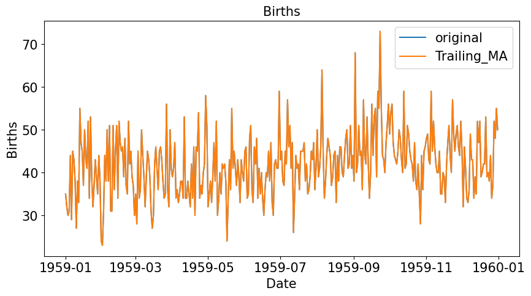

# Smoothing

Kỹ thuật làm mịn là một trong các kỹ thuật tiền xử lý dữ liệu để loại bỏ các nhiễu trong dữ liệu. Việc làm mịn dữ liệu giúp thể hiện rõ tính mùa vụ của dữ liệu và giúp đơn giản hóa các mô hình dự đoán.

Các kỹ thuật làm mịn dữ liệu bao gồm:

- Làm mịn trung bình trượt (Moving Average Smoothing)
- làm mịn cấp số nhân (Exponential smoothing)

## Moving Average Smoothing

Có 2 loại trung bình trượt : Centered MA và Trailing MA

### Centered Moving Average

Với trung bình trượt với cửa sổ trượt $k$ bằng 3 ta có:
$\begin{align}
\Large \bar{y}_{T} = \frac{y_{T+1} + y_{T} + y_{T-1}}{3}
\end{align}$

Tổng quát hơn

$\begin{align}
\Large \bar{y}_{T} = \frac{1}{m}  \sum_{j=-m}^{m}{y_{T+j}}
\end{align}$

Trong đó $k = 2m + 1$

Phương pháp này sử dụng giá trị tương lai $y_{T+1}$ do đó không áp dụng được vào các mô hình dự báo. Phương pháp dùng để thống kê mô tả dữ liệu, là một phương pháp để loại bỏ xu hướng và tính mùa vụ của Time Series

### Trailing Moving Average

Với trung bình trượt với cửa sổ trượt $k$ bằng 3 ta có

$\begin{align}
\Large \bar{y}_{T} = \frac{y_{T} + y_{T - 1} + y_{T - 2}}{3}
\end{align}$

Tổng quát hơn

$\begin{align}
\Large \bar{y}_{T} = \frac{1}{k} \sum^{k}_{i=1}{y_{T-i+1}}
\end{align}$

Phương pháp này chỉ sử dụng dữ liệu quá khứ nên có thể áp dụng cho việc dự báo các giá trị tương lai

### Ví dụ

Dưới đây là ví dụ về số Sales quần áo của US


```python
df = pd.read_csv('../data/us-retail-sales.csv')
df['lag_1'] = df['Clothing'].shift(1)
df['lag_2'] = df['Clothing'].shift(2)
df['lead_1'] = df['Clothing'].shift(-1)
df['Centered_MA'] = (df['Clothing'] + df['lead_1'] + df['lag_1'])/3
df['Trailing_MA'] = (df['Clothing'] + df['lag_1'] + df['lag_2'])/3
```

```
		 Month	 Clothing	  lag_1		lag_2	 lead_1	  Centered_MA	 Trailing_MA
275	2014-12-01		32760	  	NaN		  NaN	15840.0	          NaN            NaN
276	2015-01-01		15840	32760.0	      NaN	18079.0	 22226.333333			 NaN
277	2015-02-01		18079	15840.0	  32760.0	20819.0	 18246.000000	22226.333333
278	2015-03-01		20819	18079.0	  15840.0	20470.0	 19789.333333	18246.000000
279	2015-04-01		20470	20819.0	  18079.0	22239.0	 21176.000000	19789.333333
...		   ...		  ...	    ...		  ...	    ...	          ...	         ...
331	2019-08-01		23829	21742.0	  21116.0	19567.0	 21712.666667	22229.000000
332	2019-09-01		19567	23829.0   21742.0	21400.0	 21598.666667	21712.666667
333	2019-10-01		21400	19567.0	  23829.0	25170.0	 22045.666667	21598.666667
334	2019-11-01		25170	21400.0	  19567.0	35157.0	 27242.333333	22045.666667
335	2019-12-01		35157	25170.0	  21400.0	    NaN	          NaN	27242.333333
```

Ta cũng có thể sử dụng phương thức `rolling()` trong Pandas

```python
df['Centered_MA'] = df['Clothing'].rolling(window=3, center=True).mean()
df['Trailing_MA'] = df['Clothing'].rolling(window=3, center=False).mean()
```

Để visualize dữ liệu, ta có thể dùng `seaborn`


```python
import seaborn as sns
import matplotlib.pyplot as plt 

plt.figure(figsize=(10,5))
plt.title("US Retail Sale - Clothing", fontsize=15)
sns.lineplot(x='Month', y='Clothing', data=df, label='original')
# sns.lineplot(x='Month', y='Centered_MA', data=df, label='Centered_MA')
sns.lineplot(x='Month', y='Centered_MA', data=df, label='Trailing_MA')
plt.xlabel('Month',fontsize=15)
plt.yticks(fontsize=15)
plt.ylabel('Clothing',fontsize=15)
plt.legend(fontsize=15)
```




Với dữ liệu bao gồm xu hướng và mùa vụ, việc gia tăng cửa sổ trượt giúp loại bỏ tính mùa vụ và chỉ để lại tính xu hướng. Ví dụ dưới đây cho dữ liệu `Số Vật liệu xây dựng đã sử dụng ở Mỹ`
với các tham số $k =6$ và $k=12$

|$k=6$|$k=12$|
|:----:|:-----:|
|| |